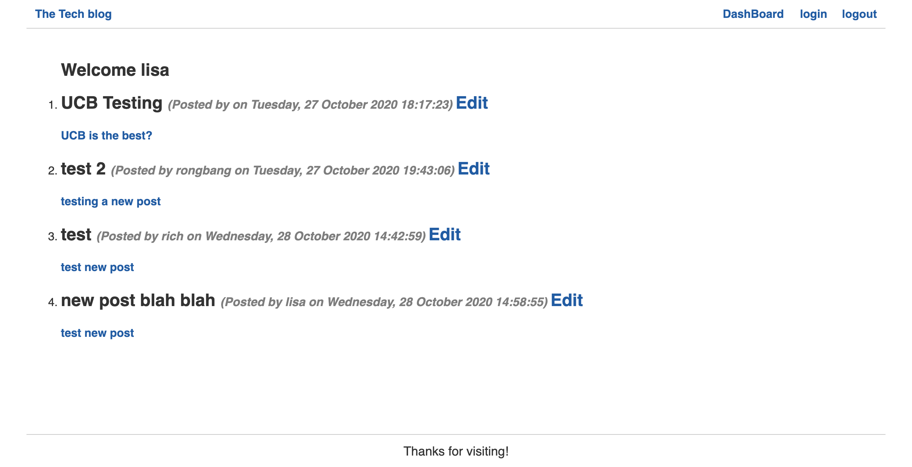

# MVC-CMS-blog

### Description

_Builded a CMS-style blog site similar to a Wordpress site, where developers can publish their blog posts and comment on other developers’ posts as well. You’ll build this site completely from scratch and deploy it to Heroku. Your app will follow the MVC paradigm in its architectural structure, using Handlebars.js as the templating language, Sequelize as the ORM, and the express-session npm package for authentication._

### Mock-Up

- encrypt user passwords
  

- Create the Login Route for Authentication
  

- Get All the Comment
  

- Homepage
  
- Dashboard/add new post
  

### Instructions on how to run the app

- Add a .env file to the root of the app with the following details

```text
DB_NAME='blog_site_db'
DB_USER='root'
DB_PW='xxx'
```
